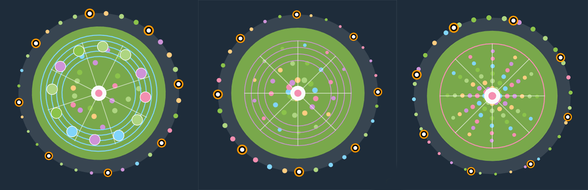

# Pacita Abad's "Wheels of Fortune" - Interactive Animation

## 🎨 Project Overview
*This project is an interactive and animated recreation of Pacita Abad's "Wheels of Fortune" artwork, developed for the Creative Coding major project. The static group code has been transformed into a dynamic, user-controlled experience where the artwork responds directly to mouse and keyboard inputs.*

- **Artist**: Pacita Abad
- **Artwork**: Wheels of Fortune  
- **Developer**: Yixin Wu
- **Animation Method**: **User Input** (Mouse & Keyboard Interactions)
- **Course**: IDEA9103 Creative Coding
- **Group**: Tut 4 Group F

## 🕹️ How to Interact with the Work
*To bring this artwork to life, simply open the `index.html` file in a modern web browser. The animation starts automatically.*

### Mouse Interactions:
- **Move Mouse Horizontally**: Control the **rotation speed** of the circles. Move left for slower rotation, right for faster.
- **Move Mouse Vertically**: Control the **size** of the circles. Move up to shrink, down to enlarge.
- **Click & Drag**: Click on any circle and drag it to a new position on the canvas.
- **Mouse Wheel**: Scroll to **zoom** the entire view in and out.
- **Double Click**: **Reset** the zoom level to default.

### Keyboard Shortcuts:
- **`C` Key**: **Cycle** through different color palettes.
- **`R` Key**: **Randomize** the pattern types (Standard, Spiral, Radial) for all circles.
- **`SPACE` Key**: **Regenerate** the entire artwork with a new random layout of circles.

## 🔄 Individual Approach to Animation

### Chosen Animation Method
*I selected **User Input** to drive my animation, focusing on creating an intuitive and engaging experience where the viewer directly manipulates and influences the artwork in real-time.*

### Animated Properties and Uniqueness
*The following properties of the original group image are animated through user input, making my submission unique:*

- **Global Rotation & Speed**: Controlled by the mouse's X-position, affecting all rotating elements.
- **Dynamic Sizing**: The scale of all circles responds to the mouse's Y-position.
- **Direct Manipulation**: Each circle can be individually grabbed and repositioned, creating a unique composition each time.
- **View Transformation**: The mouse wheel allows zooming into the fine details of the patterns or viewing the entire composition from a distance.
- **Pattern Randomization**: The `R` key instantly shuffles between three distinct internal patterns for each circle.

***Differentiation from Group Members**: While other members may explore time-based changes, audio reactivity, or noise-driven animations, my work is defined by **direct user control and manipulation**. The artwork becomes a dynamic playground, allowing users to explore countless configurations and relationships between the visual elements that I introduced, such as the multiple pattern types.*

## 💡 Inspiration for Animation

*For the animation and interaction design, I drew inspiration from several concepts:*

- **Modern UI/UX Principles**: The goal was to create interactions that feel smooth, immediate, and intuitive, similar to polished web applications. The drag-and-drop and zoom functionalities are inspired by graphic design software and map interfaces, giving the user a sense of direct control.
- **Interactive Art Installations**: I was influenced by digital installations in museums where visitors' movements and actions directly alter the digital piece, creating a unique experience for each participant.
- **Generative Art Tools**: Applications like Processing visualizers, which often allow parameter manipulation in real-time, inspired the connection between user input and visual output.

### Reference Images:

1. **The Original Artwork**

2. **Interaction Inspiration**: A screenshot or GIF of a well-known application with elegant drag-and-drop and smooth zoom (e.g., Google Maps). This visually communicates the source of my interaction philosophy.

3. **Pattern Mode Examples**: The **collage image** shows the three different pattern modes (Standard, Spiral, Radial) my code implements. This visually demonstrates the creative extension I built upon the group's base code.

## 🔧 Technical Explanation

### How the Individual Code Animates the Image
*The animation system is built on a structure that separates the core drawing functions from the animation logic and user input handling.*

1. **Core Loop & State Management**: The `draw()` function runs 60 times per second, continuously updating global variables (like `rotationAngle`) and redrawing all circles. Each circle is an object storing its own state (position, size, rotation, pattern type).
2. **Input Mapping**: Mouse and keyboard events are captured and mapped to animation parameters:
   - `mouseX` and `mouseY` are fed into `map()` functions to control rotation speed and scale.
   - The `mousePressed()` and `mouseReleased()` functions handle the drag-and-drop logic, calculating offsets and toggling a drag state.
   - The `mouseWheel()` event modifies a global `zoomLevel` variable, which is applied using `scale()` in the `draw()` function.
3. **Pattern System**: The code introduces three distinct drawing functions (`drawStandardPattern`, `drawSpiralPattern`, `drawRadialPattern`). The `patternType` property of each circle determines which function is called, allowing for visual diversity.

### Changes from the Group Code
- **Refactored into an Object-Based System**: The group's procedural drawing logic was restructured to store circle data in objects, enabling individual control and state management for animation.
- **Introduced Advanced Interactions**: Added the entire zoom system, drag-and-drop physics, and pattern randomization, which were not present in the original static version.
- **Enhanced Visual Complexity**: Added multiple pattern-drawing algorithms and a global pulsing effect to create a richer, more dynamic visual experience compared to the group's single-style circles.

### External Tools and Techniques
The mouseWheel(event) function uses the 'event.delta' property to control zoom.
This specific implementation for smooth zoom control was referenced from the p5.js official documentation.Reference: https://p5js.org/reference/#/p5/mouseWheel